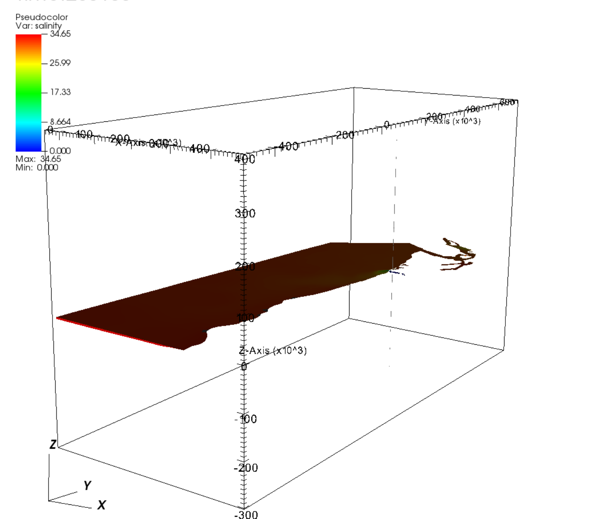

# Installing on Ubuntu 20
Note: These instructions don't make a `build` directory, it just does CMake in the source directory which is not great practice.  It will be good to modify the instructions (and test them again).

Install VisIt on a Jetstream2 instance.  Assuming you have an account on Jetstream2:
- Go to the Project page
- Click Create, choose Instance
- Choose Ubuntu 20.04, to be compatible with an older version of VisIt

Create instance:
- Name: visit-plugin-for-schism
- m3.medium
- Keep default 60GB
- 1 instance
- Yes, Enable web desktop
- Create

Click visit-plugin-for-schism, then Connect to Web Desktop.  Click the terminal icon. 

See the VisIt User Guide, [Installing and Starting VisIt](https://visit-sphinx-github-user-manual.readthedocs.io/en/develop/getting_started/Installing_VisIt.html)

We will use VisIt version [3.1.4](https://visit-dav.github.io/visit-website/releases-as-tables/#series-31) so we can use server mode on Expanse.  Get the source code and the install script.
```
wget https://github.com/visit-dav/visit/releases/download/v3.1.4/visit3_1_4.linux-x86_64-ubuntu20.tar.gz
wget https://github.com/visit-dav/visit/releases/download/v3.1.4/visit-install3_1_4
```
Change to executable mode
```
chmod +x visit-install3_1_4
```
For the following, we install visit in the home directory to avoid using sudo.  Choose '1', no specific configuration.
```
./visit-install3_1_4 3.1.4 linux-x86_64-ubuntu20 ~/visit
1
```
Set the path for the executable
```
export PATH=~/visit/bin:$PATH
```
Get a sample FVCOM file from OSN:
```
wget https://renc.osn.xsede.org/ees210015-bucket01/FVCOM/mi_gem_archive/042020161/mi_0001.nc
```

Try VisIt, open the FVCOM file, take a look:
```
visit
```
It works.

Now try the steps to install the plugin.

Get the plugin code:
```
git clone https://github.com/schism-dev/schism_visit_plugin.git
cd schism_visit_plugin
```

Before starting:

Stop it from using Ubuntu compiler:
```
alias c++='g++'
alias cc='gcc'
```


Install the unstructure_data plugin:
```
cd unstructure_data
```
Save a copy of the main VisIt plugin class files to your home directory. These files will be overwritten in the next step by VisIt's code skeleton generating tool.
```
cp avtSCHISMFileFormat.C ~
cp avtSCHISMFileFormat.h ~
```
The command `xml2plugin` is a VisIt command.
```
xml2plugin -clobber SCHISMOutput.xml
```
SCHISMOutput.xml is the file used by VisIt code generating tool to create code skeleton and makelist file.

Use two backup plugin class file to overwrite the files avtSCHISMFileFormat.C and avtSCHISMFileFormat.h.
```
cp ~/avtSCHISMFileFormat.C .
cp ~/avtSCHISMFileFormat.h .
```

Use `cmake` to create the `make` system.
```
cmake -DCMAKE_BUILD_TYPE:STRING=Release
```

Run `make` to build plugins binary. 
```
make
```

There should be four new files in ~/.visit/3.1.4/linux-x86_64/plugins/databases:
```
libESCHISMDatabase_par.so
libESCHISMDatabase_ser.so
libISCHISMDatabase_par.so
libMSCHISMDatabase_par.so
```
So far, so good.

Repeat the steps for the other plugins:
```
cd ~/schism_visit_plugin/prop
cp avtpropFileFormat.C ~
cp avtpropFileFormat.h ~
xml2plugin -clobber prop.xml
cp ~/avtpropFileFormat.C .
cp ~/avtpropFileFormat.h .
cmake -DCMAKE_BUILD_TYPE:STRING=Release
make
ls ~/.visit/3.1.4/linux-x86_64/plugins/databases
```
Works.

And
```
cd ~/schism_visit_plugin/gr3
cp avtgr3FileFormat.C ~
cp avtgr3FileFormat.h ~
xml2plugin -clobber gr3.xml
cp ~/avtgr3FileFormat.C .
cp ~/avtgr3FileFormat.h .
cmake -DCMAKE_BUILD_TYPE:STRING=Release
make
ls ~/.visit/3.1.4/linux-x86_64/plugins/databases
```
Works.

And
```
cd ~/schism_visit_plugin/mdschism
cp avtMDSCHISMFileFormat.C ~
cp avtMDSCHISMFileFormat.h ~
xml2plugin -clobber mdschism.xml
cp ~/avtMDSCHISMFileFormat.C .
cp ~/avtMDSCHISMFileFormat.h .
cmake -DCMAKE_BUILD_TYPE:STRING=Release
make
```
Error.

So, this is where we hack the makefiles, as per Eric's email (see below), and it works.
```
exouser@visit-plugin-for-schism:~/schism_visit_plugin/mdschism$ ls ~/.visit/3.1.4/linux-x86_64/plugins/databases
libEMDSCHISMDatabase_par.so  libEpropDatabase_par.so  libMMDSCHISMDatabase.so
libEMDSCHISMDatabase_ser.so  libEpropDatabase_ser.so  libMSCHISMDatabase.so
libESCHISMDatabase_par.so    libIMDSCHISMDatabase.so  libMgr3Database.so
libESCHISMDatabase_ser.so    libISCHISMDatabase.so    libMpropDatabase.so
libEgr3Database_par.so	     libIgr3Database.so
libEgr3Database_ser.so	     libIpropDatabase.so
```

*from Eric*

Remove references to libraries in the CXX_FLAGS in schism_visit_plugin/mdschism/CMakeFiles/*.dir/flags.make

For example:
```
[50 ~/schism_visit_plugin/mdschism/CMakeFiles/EMDSCHISMDatabase_par.dir ]$more flags.make
# CMAKE generated file: DO NOT EDIT!
# Generated by "Unix Makefiles" Generator, CMake Version 3.14

# compile CXX with /bin/c++
CXX_FLAGS = -fPIC   -std=c++0x  -DPARALLEL -DMPICH_IGNORE_CXX_SEEK -DMPICH_SKIP_MPICXX \ 
-DOMPI_SKIP_MPICXX -DMPI_NO_CPPBIND -DPARALLEL -DMPICH_IGNORE_CXX_SEEK -I/opt/openmpi-3.1.6-ib/include
```
i.e. we removed this part of CXX_FLAGS:

libnetcdf_c++.a libnetcdf.a libhdf5_hl.so libhdf5.so libsz.so libz.so


Now try it out.  Links to data are on the [SCHISM visualization page](https://schism-dev.github.io/schism/master/getting-started/visualization.html)

```
wget -r -nH --cut-dirs=2 -np -R "index.html*" http://ccrm.vims.edu/yinglong/SVN_large_files/Scribe_IO_outputs/
wget -r -nH --cut-dirs=2 -np -R "index.html*" http://ccrm.vims.edu/yinglong/SVN_large_files/SCHISM_v5.6.1_sample_outputs/
```

For SCHISM_v5.6.1_sample_outputs:


It works:


When I use the new IO, I need to specify "SCHISM" when reading in the file, and it has an artifact that makes it impossible to do the transform.


Try client-server mode.  Instructions are here: /cm/shared/examples/sdsc/visit/README

